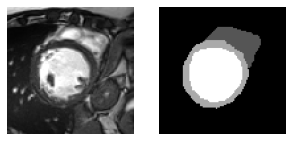
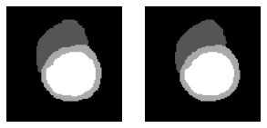

# Cardiac MRI segmentation with U-Net

I implemented this U-Net for the Neural Computation module at the University
of Birmingham in 2021. It segments cardiac MR slices into background, right
ventricle, myocardium, and left ventricle. We compared it with an FCN and
experimented with different model and training configurations.

## Data

This project uses the [ACDC dataset](https://www.creatis.insa-lyon.fr/Challenge/acdc/),
described by [Bernard et al., 2018](https://doi.org/10.1109/TMI.2018.2837502).
Our coursework split contained 100 training slices, 20 validation slices, and
80 unlabelled test slices.

MRI slice on the left, reference mask on the right:



Reference mask on the left, U-Net prediction on the right, from an earlier
training experiment:



The figures are in [`data/`](data/), including eight prediction comparisons.

## Results

The selected U-Net used four encoder and decoder levels, cross-entropy loss,
and Adam with `lr=0.001`, `amsgrad=True`, and `weight_decay=1e-8`.
Its best validation foreground Dice was **0.8882506773** at epoch 72.
This metric averages Dice for the three anatomical classes, excluding background.

The [notebook](notebooks/cardiac_segmentation.ipynb) contains the training run
and output. The [report](report/cardiac_segmentation_report.pdf) discusses the
experiments, with the model comparisons in
[`results/hyperparameter_tuning.xlsx`](results/hyperparameter_tuning.xlsx).

## Code

[`src/unet_cardiac_segmentation`](src/unet_cardiac_segmentation) contains the
image loaders, U-Net, Dice calculation, and training loops.

The project requires Python 3.11 or newer and [uv](https://docs.astral.sh/uv/).

```bash
uv sync --group dev --extra notebook
uv run pytest
```

To train with the notebook, arrange the image and mask files as follows:

```text
data/train/image/*.png
data/train/mask/<same-stem>_mask.png
data/val/image/*.png
data/val/mask/<same-stem>_mask.png
data/test/image/*.png
```

## AI assistance

I used AI tools in 2026 to organise this repository, restructure the existing
code, and edit the documentation. I wrote the original implementation in 2021
without AI assistance. Our original code, reports, experiments, and recorded
results are preserved in this repository or its Git history.
